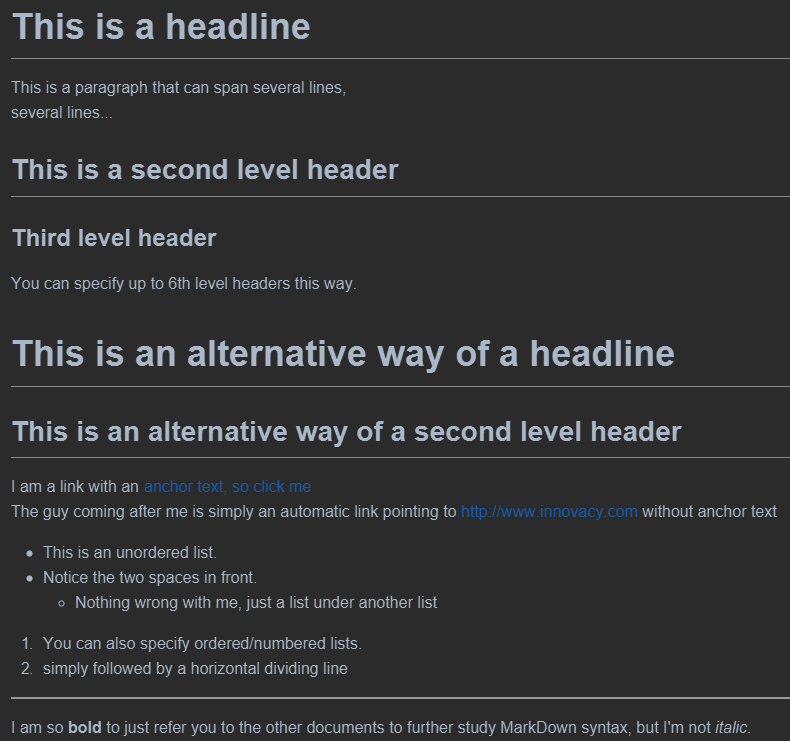

# Getting Started

You'll find that everything is extremely simple to use and set up, even the advanced features should be as easy.

In your installation you can browse the docs folder (yes, this documentation, as it's written in MarkDown and 
adds Up! functionality) to see examples of how to write yours or experiment around. 

It is easy to understand most things by just looking on the source files of the documentation and how they are rendered, 
if you prefer that over reading documentation.

## First Steps

Start by creating an index.md in the main folder. This will become your frontpage. This also will ensure that no 
"page not found" appears any longer, when the installation path is called without a filename specified. 
The latter applies also, to all directories you may create. 

From here you can name and structure your files and your directories any way you see fit for your site. Up! imposes no rules or limitations in that matter.

## MarkDown Syntax

To learn specifics about the MarkDown language, you should read one or all of the following sources:

  * http://daringfireball.net/projects/markdown/basics
  * https://guides.github.com/features/mastering-markdown/
  
Up! uses the Github flavoured markdown syntax, so you would want to refer 
to https://github.com/adam-p/markdown-here/wiki/Markdown-Cheatsheet for a complete reference after learning the basics. 

Exceptions and extensions are handled in this documentation.

A simple example shows how easy it is to format and outline a document in MarkDown:

    # This is a headline
    
    This is a paragraph that can span several lines, 
    several lines... 
    
    ## This is a second level header
    
    ### Third level header
    
    You can specify up to 6th level headers this way.
     
    This is an alternative way of a headline
    ================================
    
    This is an alternative way of a second level header
    -------------
    
    I am a link with an [anchor text, so click me](http://www.innovacy.com/)
    The guy coming after me is simply an automatic link pointing to http://www.innovacy.com without anchor text
    
       * This is an unordered list.
       * Notice the two spaces in front.
         * Nothing wrong with me, just a list under another list
    
       1. You can also specify ordered/numbered lists.
       3. simply followed by a horizontal dividing line
       
     *****************
     
     I am so **bold** to just refer you to the other documents to further study MarkDown syntax, but I'm not *italic*. 

This will be rendered similar to (a dark style was choosen simply to separate it clearly here): 

For a truely extensive example, check the file [test.md](test.md)

## Document Title in browser / SEO Titles

Up! will pick (as far it will find one) the first 1st level headline as the title of the page for browsers and search engines.

If you have none specified and you have a title specific in the config, it will pick this one.

If there is a headline and a title in the config, it will append the title from the config to the headline and use the combined one as title.
This allows to have some common title text throughout the whole site.

## Linking to other documents

At some point, you'll want to directly link to other documents in your MarkDown. 

Refer to https://github.com/adam-p/markdown-here/wiki/Markdown-Cheatsheet#links for a complete reference.

Say, you want to link to a file called Help.md, Up! understands and resolves all of these file notations:

    This a [link](Help.md) to Help. This is the default all-compatible way.
    This a [link](Help) to Help.
    This a [link](Help.html) to Help.
    This a [link](!#Help.md) to Help. This is a mdwiki-style link.

No matter which you prefer to use, Up! will always create links with the `.html` extension in the rendered document, 
which it can automatically resolve to the proper file. However, if compatibility with other parsers is important to you, 
you should use only the first syntax in your documents.

The last syntax with the `!#`, is only supported for mdwiki compatibility, however it should rather not be used, as mdwiki recognizes also the first. 

Note: Be aware, since you can add and link any other files, even html files, if you have added two files 
like Help.md and Help.html, the `.html` file with the same name will have priority over a `.md` file and 
will be the one called in the browser, even if you defined `Help.md`. This implementation detail may change in future. 
