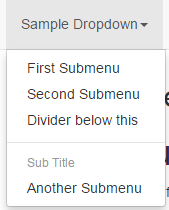

# This is an Up! test file for all possible syntax (and the document title)

# First level heading

## Second level heading

### Third level heading

#### Fourth level heading

##### Fifth level heading

###### Sixth level heading

Alternative First level heading
===============================

Alternative Second level heading
--------------------------------


Default Link: [link](index.md)

Automatic extension link: [link](index)

HTML extension link: [link](index.html)

MDWiki-style link: [link](!#index.md)

----------------

[I'm an inline-style link](https://www.google.com)

[I'm an inline-style link with title](https://www.google.com "Google's Homepage")

[I'm a reference-style link][Arbitrary case-insensitive reference text]

[I'm a relative reference to a file](../LICENSE.txt)

[You can use numbers for reference-style link definitions][1]

Or leave it empty and use the [link text itself].

http://www.example.com or <http://www.example.com> are clickable links too.

Some text to show that the reference links can follow later.

[arbitrary case-insensitive reference text]: https://www.mozilla.org
[1]: http://slashdot.org
[link text itself]: http://www.reddit.com

****************

Inline-style (internal):


Inline-style with alt text (external): 


Inline-style with title (external): 


Reference-style (internal): 
![alt text][menu-dropdown]

Reference-style (external): 
![alt text][logo]

[logo]: https://github.com/adam-p/markdown-here/raw/master/src/common/images/icon48.png "Logo Title Text 2"
[menu-dropdown]: img/menu-sample-dropdown.png "Menu Dropdown Sample"

#### Images as Links

[](http://www.placekitten.com)

[](http://www.placekitten.com "Miau")

----------------

Inline `code` has `back-ticks around` it.

    Indented `code` block
    This should render with [Markdown](getting-started.md) syntax highlighting.

```javascript
var s = "JavaScript syntax highlighting";
alert(s);
```
 
```python
s = "Python syntax highlighting"
print s
```
 
```
No language indicated, so no syntax highlighting. 
But let's throw in a <b>tag</b>. Did it recognize it?
```

****************

Colons can be used to align columns.

| Tables        | Are           | Cool  |
| ------------- |:-------------:| -----:|
| col 3 is      | right-aligned | $1600 |
| col 2 is      | centered      |   $12 |
| zebra stripes | are neat      |    $1 |

There must be at least 3 dashes separating each header cell.
The outer pipes (|) are optional, and you don't need to make the 
raw Markdown line up prettily. You can also use inline Markdown.

Markdown | Less | Pretty
--- | --- | ---
*Still* | `renders` | **nicely**
1 | 2 | 3

----------------

> Blockquotes are very handy in email to emulate reply text.
> This line is part of the same quote.

Quote break.

> This is a very long line that will still be quoted properly when it wraps. Oh boy let's keep writing to make sure this is long enough to actually wrap for everyone. Oh, you can *put* **Markdown** into a blockquote. 

________________

<dl>
  <dt>Definition list</dt>
  <dd>Is something people use sometimes.</dd>

  <dt>Markdown in HTML</dt>
  <dd>Does *not* work **very** well. Use HTML <em>tags</em>.</dd>
</dl>

- - - - - - - - -

Here's a line for us to start with.

This line is separated from the one above by two newlines, so it will be a *separate paragraph*.

This line is also a separate paragraph, but...
This line is only separated by a single newline, so it's a separate line in the *same paragraph*.

________________

1. First ordered list item
2. Another item
  * Unordered sub-list. 
1. Actual numbers don't matter, just that it's a number
  1. Ordered sub-list
4. And another item.

   You can have properly indented paragraphs within list items. Notice the blank line above, and the leading spaces (at least one, but we'll use three here to also align the raw Markdown).

   To have a line break without a paragraph, you will need to use two trailing spaces.⋅⋅
   Note that this line is separate, but within the same paragraph.⋅⋅
   (This is contrary to the typical GFM line break behaviour, where trailing spaces are not required.)

* Unordered list can use asterisks
- Or minuses
+ Or pluses

* * * * * * * *

Emphasis, aka italics, with *asterisks* or _underscores_.

Strong emphasis, aka bold, with **asterisks** or __underscores__.

Combined emphasis with **asterisks and _underscores_**.

Strikethrough uses two tildes. ~~Scratch this.~~

* * * * * * * *

#### Alerts

Warning: This is a warning

Achtung: This is a Achtung

Attention: This is a attention

Warnung! This is a warnung

Atención: This is a atención

Warning! This is a warning

Note: Just a note

beachte: Just a beachte

Hint: You hint me

tip: You tip me

Tipp: You tipp me

hinweis: You hinweis me

_ _ _ _ _ _ _ _ _


#### Youtube videos

[](http://www.youtube.com/watch?v=Lc-vINJmhNk)

[](https://www.youtube.com/watch?v=JuyB7NO0EYY)

[](https://youtu.be/PTdzCAGH3lU)

_ _ _ _ _ _ _ _ _

Unsupported Gimmicks (these should be simply removed to avoid weird output or degrade where possible)

[gimmick:FacebookLike](http://www.facebook.com)

[gimmick:ForkMeOnGitHub](http://www.github.com/)

[gimmick:gist](5641564)

[gimmick:googlemaps](Madison Square Garden, NY)

[gimmick:googlemaps(maptype: 'terrain', zoom: 9, marker: 'false')](Eiffel Tower, Paris)

[gimmick:googlemaps({maptype: 'satellite', zoom: 17})](Colloseum, Rome, Italy)

[gimmick:yuml]( [HttpContext]uses -.->[Response] )

[gimmick:yuml (type: 'class')]([User|+Forename;+Surname;+HashedPassword;-Salt])

[gimmick: math]()

$$ x = \frac{-b \pm \sqrt{b^2 - 4ac}}{2a} $$

$$ \int u \frac{dv}{dx}\,dx=uv-\int
\frac{du}{dx}v\,dx\lim_{n\rightarrow \infty }
\left (  1 +\frac{1}{n} \right )^n
$$


[gimmick:TwitterFollow](@twitter)

[gimmick:Disqus](twitter)

[gimmick:chart ({dataColumns: ['Avg'], labelColumn: "Sprint", chartType: 'Line', width: '660px', height: '300px'})]()


------------- 

HTML character encoding

Less-than sign: <
 
Greather-than sign: >

Ampersand: &

